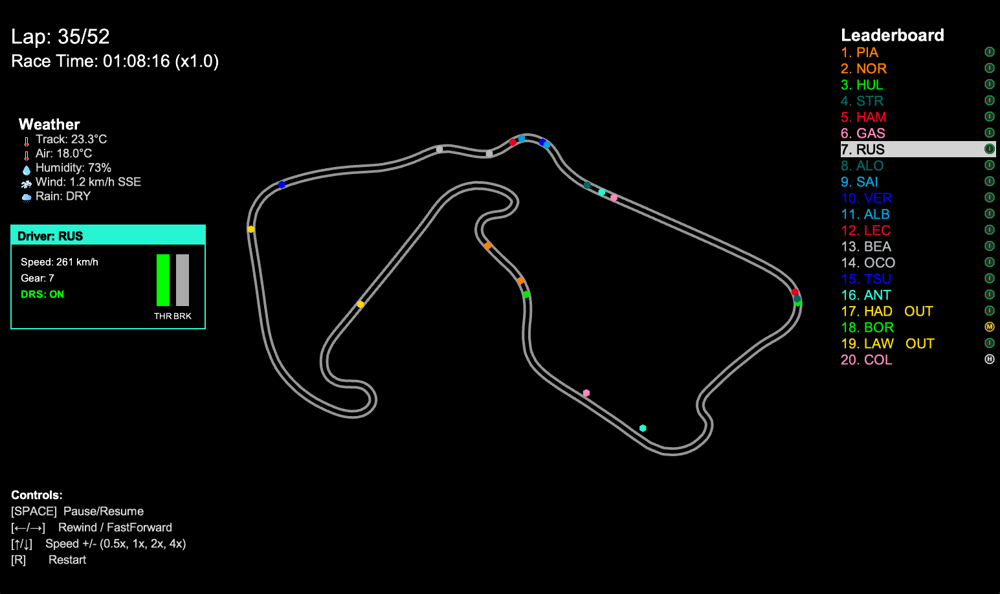

# F1 Race Replay 🏎️ 🏁

A Python application for visualizing Formula 1 race telemetry and replaying race events with interactive controls and a graphical interface.



## Features

- **Race Replay Visualization:** Watch the race unfold with real-time driver positions on a rendered track.
- **Leaderboard:** See live driver positions and current tyre compounds.
- **Lap & Time Display:** Track the current lap and total race time.
- **Driver Status:** Drivers who retire or go out are marked as "OUT" on the leaderboard.
- **Interactive Controls:** Pause, rewind, fast forward, and adjust playback speed using on-screen buttons or keyboard shortcuts.
- **Legend:** On-screen legend explains all controls.
- **Driver Telemetry Insights:** View speed, gear, DRS status, and current lap for selected drivers when selected on the leaderboard.
- **GUI Menu**: Easy to use GUI menu to select races and start replays.

## Controls

- **Pause/Resume:** SPACE or Pause button
- **Rewind/Fast Forward:** ← / → or Rewind/Fast Forward buttons
- **Playback Speed:** ↑ / ↓ or Speed button (cycles through 0.5x, 1x, 2x, 4x)
- **Set Speed Directly:** Keys 1–4

## Qualifying Session Support (in development)

Recently added support for Qualifying session replays with telemetry visualization including speed, gear, throttle, and brake over the lap distance. This feature is still being refined.

## Requirements

- Python 3.8+
- [FastF1](https://github.com/theOehrly/Fast-F1)
- [Arcade](https://api.arcade.academy/en/latest/)
- numpy
- [Node.js](https://nodejs.org/en) (GUI only)

Install dependencies:

```bash
pip install -r requirements.txt
```

FastF1 cache folder will be created automatically on first run. If it is not created, you can manually create a folder named `.fastf1-cache` in the project root.

## Usage (GUI)

### Windows

Running the gui is as simple as running the `start-gui.bat` script. This script will create a virtual environment and install the required dependencies. Once the dependencies are installed, the GUI will be started.

### Linux / MacOS

To run the GUI on Linux or MacOS, currently you will need to install the dependencies and start the GUI manually.
To install the dependencies, run the following command in the terminal:

1. Create a Python virtual environment:

   ```bash
   python -m venv .venv
   ```

2. Activate the Python virtual environment:

   ```bash
   source .venv/bin/activate
   ```

3. Install the Python dependencies:

   ```bash
   pip install -r requirements.txt
   ```

4. Install the Node.js dependencies:

   ```bash
   cd gui
   npm install
   ```

5. Start the GUI:

   ```bash
   npm run dev
   ```

## Usage CLI
## Environment Setup

To get started with this project locally, you can follow these steps:

1. **Clone the Repository:**
   ```bash
   git clone https://github.com/IAmTomShaw/f1-race-replay
    cd f1-race-replay
    ```
2. **Create a Virtual Environment:**
    This process differs based on your operating system.
    - On macOS/Linux:
      ```bash
      python3 -m venv venv
      source venv/bin/activate
      ```
    - On Windows:
      ```bash
      python -m venv venv
      .\venv\Scripts\activate
      ```
3. **Install Dependencies:**
    ```bash
    pip install -r requirements.txt
    ```

4. **Run the Application:**
    You can now run the application using the instructions in the Usage section below.

## Usage

**NEW GUI MENU:** To use the new GUI menu system, you can simply run:
```bash
python main.py --gui
```
This will open a graphical interface where you can select the year and round of the race weekend you want to replay. This is still a new feature, so please report any issues you encounter.

**NEW CLI MENU:** To use the new CLI menu system, you can simply run:
```bash
python main.py --cli
```
This will prompt you with series of questions and a list of options to make your choice from.

If you would prefer to use the command line arguments directly, you can do so as follows:

Run the main script and specify the year and round:

```bash
python main.py --year 2025 --round 12
```

To run without HUD:
```bash
python main.py --year 2025 --round 12 --no-hud
```

To run a Sprint session (if the event has one), add `--sprint`:

```bash
python main.py --year 2025 --round 12 --sprint
```

The application will load a pre-computed telemetry dataset if you have run it before for the same event. To force re-computation of telemetry data, use the `--refresh-data` flag:

```bash
python main.py --year 2025 --round 12 --refresh-data
```

### Search Round Numbers (including Sprints)

To find the round number for a specific Grand Prix event, you can use the `--list-rounds` flag along with the year to return a list of events and their corresponding round numbers:

```bash
python main.py --year 2025 --list-rounds
```

To return a list of events that include Sprint sessions, use the `--list-sprints` flag:

```bash
python main.py --year 2025 --list-sprints
```

### Qualifying Session Replay

To run a Qualifying session replay, use the `--qualifying` flag:

```bash
python main.py --year 2025 --round 12 --qualifying
```

To run a Sprint Qualifying session (if the event has one), add `--sprint`:

```bash
python main.py --year 2025 --round 12 --qualifying --sprint
```

## File Structure

```
f1-race-replay/
├── main.py                    # Entry point, handles session loading and starts the replay
├── requirements.txt           # Python dependencies
├── README.md                  # Project documentation
├── roadmap.md                 # Planned features and project vision
├── resources/
│   └── preview.png           # Race replay preview image
├── src/
│   ├── f1_data.py            # Telemetry loading, processing, and frame generation
│   ├── arcade_replay.py      # Visualization and UI logic
│   └── ui_components.py      # UI components like buttons and leaderboard
│   ├── interfaces/
│   │   └── qualifying.py     # Qualifying session interface and telemetry visualization
│   │   └── race_replay.py    # Race replay interface and telemetry visualization
│   └── lib/
│       └── tyres.py          # Type definitions for telemetry data structures
│       └── time.py           # Time formatting utilities
└── .fastf1-cache/            # FastF1 cache folder (created automatically upon first run)
└── computed_data/            # Computed telemetry data (created automatically upon first run)
```

## Customization

- Change track width, colors, and UI layout in `src/arcade_replay.py`.
- Adjust telemetry processing in `src/f1_data.py`.

## Contributing

There have been several contributions from the community that have helped enhance this project. I have added a [contributors.md](./contributors.md) file to acknowledge those who have contributed features and improvements.

Please see [roadmap.md](./roadmap.md) for planned features and project vision.

For contributing to the project, please see [CONTRIBUTING.md](./CONTRIBUTING.md). And look for issues labeled as `good first issue` or `help wanted` to get started.

# Known Issues

- The leaderboard appears to be inaccurate for the first few corners of the race. The leaderboard is also temporarily affected by a driver going in the pits. At the end of the race, the leaderboard is sometimes affected by the drivers' final x,y positions being further ahead than other drivers. These are known issues caused by inaccuracies in the telemetry and are being worked on for future releases. It's likely that these issues will be fixed in stages as improving the leaderboard accuracy is a complex task.

## 📝 License

This project is licensed under the MIT License.

## ⚠️ Disclaimer

No copyright infringement intended. Formula 1 and related trademarks are the property of their respective owners. All data used is sourced from publicly available APIs and is used for educational and non-commercial purposes only.

---

Built with ❤️ by [Tom Shaw](https://tomshaw.dev)
