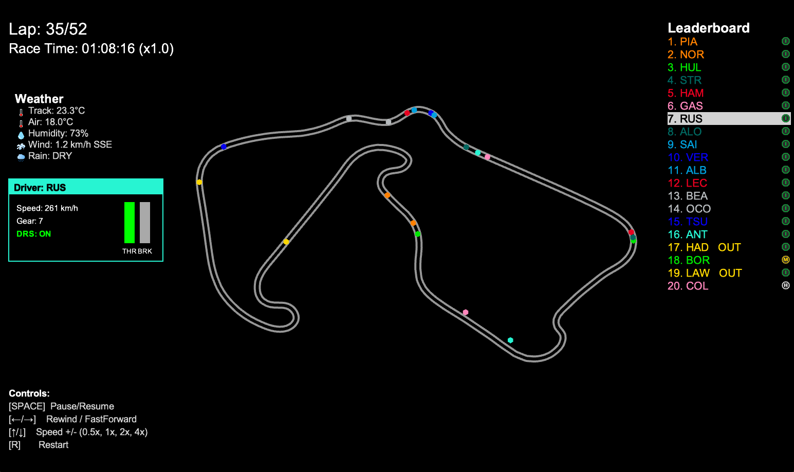

# F1 Race Replay 🏎️ 🏁

A desktop application for visualizing Formula 1 race telemetry and replaying Grand Prix events with interactive controls, track maps, dynamic leaderboards, and live pit wall insights. Powered by [FastF1](https://github.com/theOehrly/Fast-F1), [Arcade](https://api.arcade.academy/en/latest/), and [PySide6](https://pypi.org/project/PySide6/).



---

## System Requirements

- **OS:** Windows 10 / Windows 11 (x64)
- **Python:** 3.11.x (3.11.9 recommended)
- **GPU:** OpenGL 3.3+ compatible hardware and drivers
- **Core Dependencies:**

  | Package     | Version                                          |
  | ----------- | ------------------------------------------------ |
  | fastf1      | 3.6.1                                            |
  | arcade      | 2.6.17                                           |
  | pyglet      | 2.0.dev23 _(pinned; required for Arcade 2.6.17)_ |
  | PySide6     | 6.8.2.1                                          |
  | numpy       | 2.1.3                                            |
  | pandas      | 2.2.3                                            |
  | scipy       | 1.14.1                                           |
  | matplotlib  | 3.10.0                                           |
  | questionary | 2.1.0                                            |
  | rich        | 13.9.4                                           |

---

## Installation

### Windows (CMD)

```cmd
git clone https://github.com/IAmTomShaw/f1-race-replay.git
cd f1-race-replay

python -m venv venv
venv\Scripts\activate.bat

python -m pip install -r requirements.txt
python main.py --diagnostics
python main.py
```

### Linux (Bash)

```bash
git clone https://github.com/IAmTomShaw/f1-race-replay.git
cd f1-race-replay

python3 -m venv venv
source venv/bin/activate

pip install -r requirements.txt
python main.py --diagnostics
python main.py
```

### macOS

```bash
git clone https://github.com/IAmTomShaw/f1-race-replay.git
cd f1-race-replay

python3 -m venv venv
source venv/bin/activate

pip install -r requirements.txt
python main.py --diagnostics
python main.py
```

> **Note:** On Linux, you may need to install system OpenGL libraries first:
> `sudo apt install libgl1-mesa-dev libglu1-mesa-dev` (Debian/Ubuntu) or
> `sudo dnf install mesa-libGL-devel` (Fedora).
> On macOS, OpenGL is provided by the system framework — no extra install needed.

---

## Usage

### GUI Mode (Default)

```powershell
python main.py
```

Opens a dark-themed race selection window. Select a season and round to launch the replay.

### CLI Mode

```powershell
python main.py --cli
```

Interactive terminal menu with arrow-key navigation.

### Direct Replay

```powershell
python main.py --viewer --year 2024 --round 1
```

| Flag             | Description                     |
| ---------------- | ------------------------------- |
| `--year <YYYY>`  | Championship year               |
| `--round <N>`    | Grand Prix round number         |
| `--sprint`       | Load Sprint session             |
| `--qualifying`   | Load qualifying session         |
| `--no-hud`       | Hide HUD overlays               |
| `--refresh-data` | Force re-download and recompute |
| `--diagnostics`  | Print environment info and exit |

---

## Keyboard Controls

| Key              | Action                       |
| ---------------- | ---------------------------- |
| `SPACE`          | Pause / Resume               |
| `1` `2` `3` `4`  | Set speed: 0.5x, 1x, 2x, 4x  |
| `UP` / `DOWN`    | Step speed up / down         |
| `LEFT` / `RIGHT` | Rewind / Fast Forward (hold) |
| `R`              | Restart replay               |
| `D`              | Toggle DRS zones             |
| `B`              | Toggle progress bar          |
| `L`              | Toggle driver labels         |
| `H`              | Show controls help           |
| `I`              | Toggle session banner        |
| `ESC`            | Exit                         |

---

## Caching

The app uses a two-tier cache:

1. **FastF1 Raw Cache (`.fastf1-cache/`)** — raw API responses (~20–80 MB per GP, downloaded on first run)
2. **Computed Telemetry (`computed_data/`)** — 25 Hz resampled frames, tyre models, track geometry (generated once, loads in < 1s on subsequent runs)

Both directories are git-ignored and generated on demand.

---

## Architecture

```
FastF1 API / Cache
       ↓
src.f1_data / src.data.telemetry_resample
       ↓
src.analytics.leaderboard & src.data.telemetry_units
       ↓
src.replay.clock (ReplayClock)
       ↓
src.interfaces.race_replay (Arcade / Pyglet rendering)
       ↓
src.streaming.broker → src.streaming.transport (TCP on :9999)
       ↓
src.gui.insights_menu & src.insights.* (PySide6 / Matplotlib)
```

---

## Project Structure

```
f1-race-replay/
├── main.py                  # Entry point
├── requirements.txt         # Dependencies
├── pytest.ini               # Test configuration
├── src/
│   ├── f1_data.py           # FastF1 data pipeline
│   ├── analytics/           # Leaderboard, tyre model
│   ├── data/                # Cache, telemetry resampling, units, qualifying
│   ├── replay/              # Clock, safety car
│   ├── streaming/           # Broker, protocol, transport
│   ├── gui/                 # PySide6 menus and dialogs
│   ├── insights/            # Telemetry viewers, pit wall, strategy
│   ├── interfaces/          # Race replay and qualifying windows
│   ├── lib/                 # Tyres, time, settings, paths
│   └── cli/                 # Terminal race selection
├── tests/
│   ├── conftest.py          # Fake module fixtures
│   └── test_all.py          # Consolidated test suite
├── images/                  # Tyre badges, weather icons
└── resources/               # Track assets, preview image
```

---

## Running Tests

```powershell
python -m pytest
```

Current state: **157 passed, 4 skipped, 0 failed**.

---

## Known Limitations

1. **DNF Runtime Behavior:** Race retirements are classified as `"post"` frames; distinct `"dnf"` markers are not present in cached telemetry. DNF behavior is formally unverified.
2. **Frame Rate Variance:** Full 20-car rendering typically achieves 12–25 FPS depending on hardware. Stationary/terminal states reach ~40 FPS. This is a product characteristic of the Arcade/Pyglet rendering stack.
3. **No Post-Race Screen:** Finished drivers remain in their final leaderboard positions; no podium screen exists.
4. **Pyglet Pinning:** `pyglet==2.0.dev23` is required for `arcade==2.6.17` compatibility. Do not upgrade independently.

---

## Troubleshooting

| Issue                              | Solution                                                                       |
| ---------------------------------- | ------------------------------------------------------------------------------ |
| Install fails / compile errors     | Use **Python 3.11.x** (not 3.12+). Verify with `python --version`.             |
| Arcade `AttributeError` at startup | Ensure `pyglet==2.0.dev23` is installed. Run `python main.py --diagnostics`.   |
| Missing sprites / icons            | Run commands from project root directory.                                      |
| `GLException` on startup           | Requires OpenGL 3.3+ GPU with updated drivers.                                 |
| Terminal hangs on first run        | FastF1 is downloading telemetry (~1-3 min). Don't terminate.                   |
| High CPU on first load             | Resampling 140k frames + tyre model fitting (~30-60s). Cached after first run. |

---

## License

MIT License. Formula 1 and related trademarks belong to their respective owners. Telemetry is sourced from publicly accessible timing feeds for non-commercial educational use.
