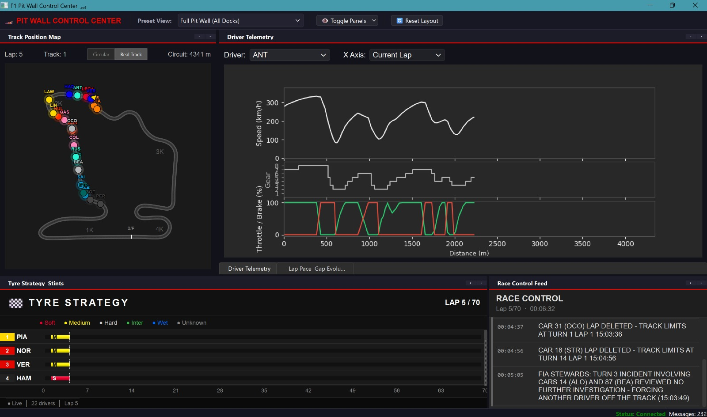

# Unified Pit Wall Dashboard

The Pit Wall Dashboard is a dockable, customizable PySide6 workspace that consolidates all live telemetry insight views into a single control center. Instead of opening separate insight windows, this dashboard embeds them as rearrangeable dock panels.



## Architecture

The dashboard (`src/gui/pit_wall_dashboard.py`) extends `PitWallWindow` and hosts five insight modules as `QDockWidget` panels:

```
┌──────────────────────────────────────────────────────────────┐
│  🏎️ PIT WALL CONTROL CENTER   [Preset View ▼] [Toggle ▼]   │
├────────────────────┬─────────────────────────────────────────┤
│                    │                                         │
│  Track Position    │  Driver Telemetry                       │
│  Map               │  (speed, gear, throttle/brake, DRS)     │
│                    │                                         │
│  • Circular view   ├─────────────────────────────────────────┤
│  • Real track view │  Lap Pace & Gap Evolution  (tabbed)     │
│                    │                                         │
├────────────────────┴──────────┬──────────────────────────────┤
│                               │                              │
│  Tyre Strategy & Stints      │  Race Control Feed           │
│  (compound timeline per       │  (FIA messages, penalties,    │
│   driver with pit stops)      │   track status changes)       │
│                               │                              │
└───────────────────────────────┴──────────────────────────────┘
```

### Dock panels

| Panel | Source Module | What it shows |
|-------|-------------|---------------|
| Track Position Map | `TrackPositionWindow` | Live driver positions on circular or real track layout |
| Driver Telemetry | `DriverTelemetryWindow` | Speed, gear, throttle/brake bars, DRS, tyre wear, gap insights |
| Tyre Strategy & Stints | `TyreStrategyWindow` | Compound timeline per driver with pit stop markers |
| Race Control Feed | `RaceControlFeedWindow` | Live FIA flags, penalties, safety car, DRS status |
| Lap Pace & Gap Evolution | `LapTimeChartWindow` | Lap time and gap-to-leader evolution charts |

## Preset Views

The toolbar includes a **Preset View** dropdown for quick layout switching:

| Preset | Visible Panels |
|--------|---------------|
| Full Pit Wall (All Docks) | All 5 panels |
| Quad View | Track, Telemetry, Tyres, Race Control |
| Driver Focus | Track + Telemetry only |
| Strategy & Pace Focus | Tyres, Race Control, Lap Pace |

## Telemetry Data Flow

The dashboard uses a **shared telemetry client** (`master_client`) pattern:

1. `PitWallDashboardWindow` connects once to the telemetry stream via the base `PitWallWindow` client
2. Incoming telemetry data packets are broadcast to all embedded insight modules via `on_telemetry_data()`
3. Connection status changes are forwarded to all panels

This avoids opening 5 separate TCP connections to the telemetry socket.

## Usage

### From the Insights Menu

Click **"Unified Pit Wall Dashboard"** under the **PIT WALL WORKSPACE** section in the F1 Insights menu.

### Standalone

```bash
python main.py --dashboard
```

### Programmatic

```python
from src.gui.pit_wall_dashboard import PitWallDashboardWindow

window = PitWallDashboardWindow()
window.show()
```

## Customization

- **Drag and dock** any panel to rearrange the layout
- **Float** panels by dragging them out of the main window
- **Tab** panels together by dropping one onto another
- **Toggle** individual panels using the toolbar menu
- **Reset** to the current preset layout using the reset button
